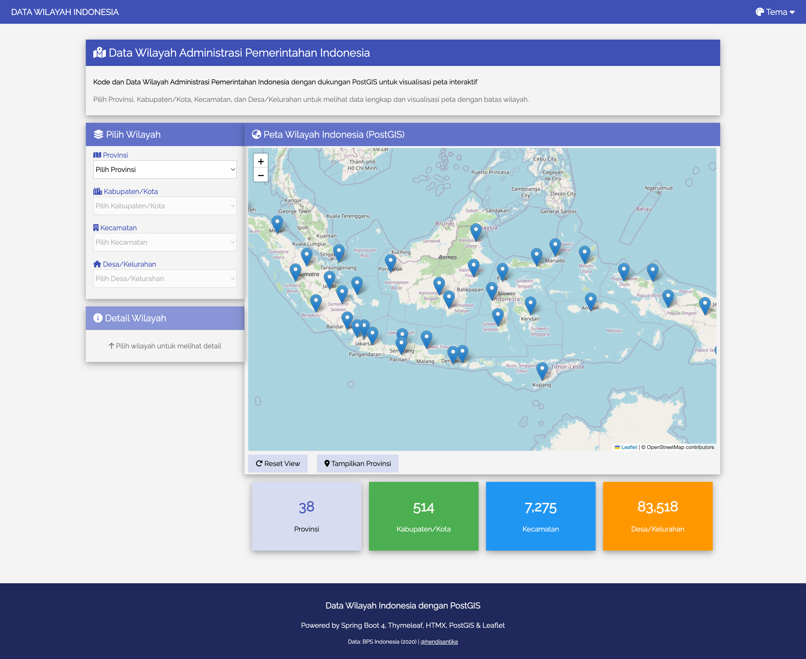
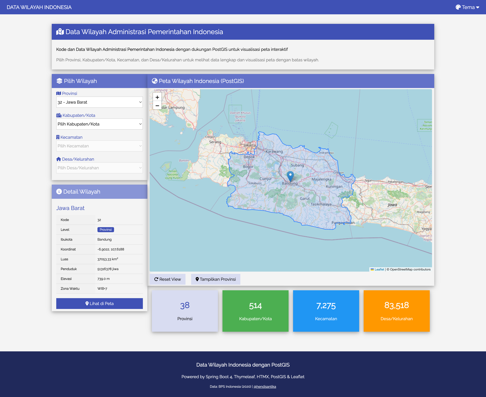
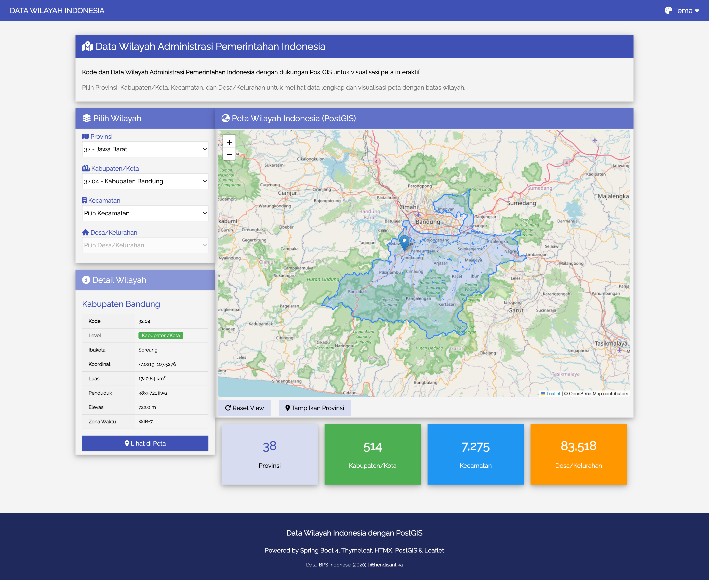
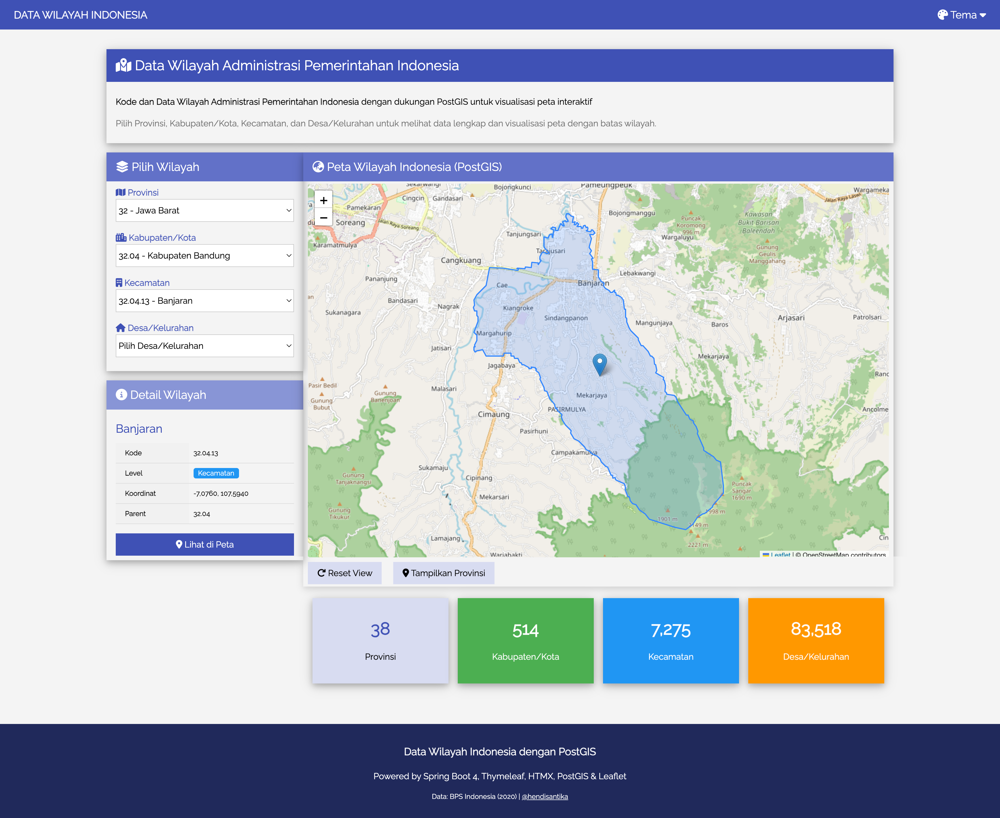
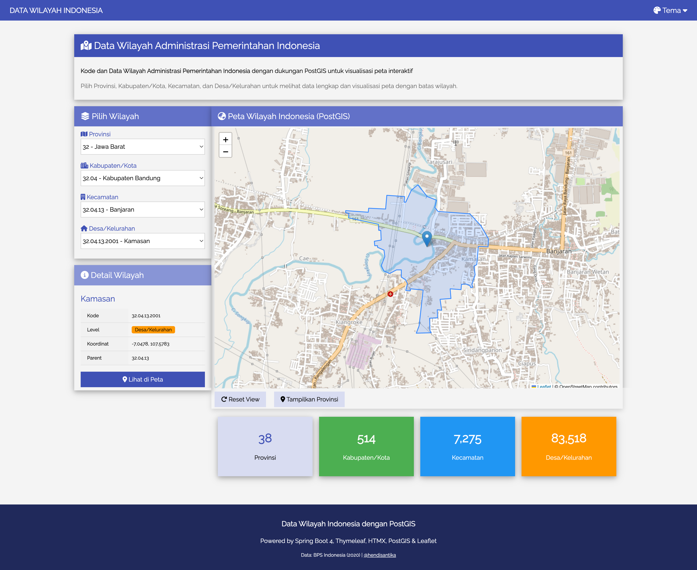
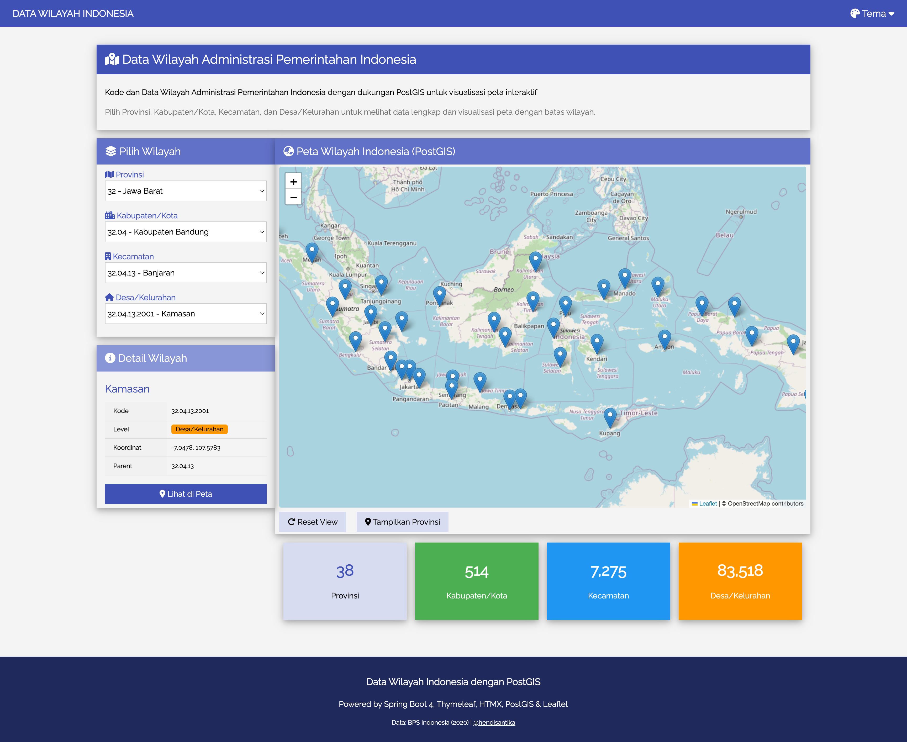

# Spring Boot PostGIS - Indonesia Administrative Boundaries

Interactive map application for exploring Indonesia's administrative boundaries (provinces, cities/regencies, sub-districts, and villages) powered by **Spring Boot**, **PostGIS**, and **Leaflet.js**.

## Screenshots

### Home Page


### Provinsi (Province) - Jawa Barat


### Kabupaten (Regency) - Kabupaten Bandung


### Kecamatan (Sub-district) - Banjaran


### Desa/Kelurahan (Village) - Kamasan


### Wilayah Indonesia Overview


## Features

- Interactive map with boundary visualization using Leaflet.js
- Hierarchical drill-down: Provinsi → Kabupaten/Kota → Kecamatan → Desa/Kelurahan
- Kabupaten boundaries computed dynamically via PostGIS `ST_Union` of kecamatan geometries
- Search across all administrative levels
- GeoJSON boundary rendering on map selection
- HTMX-powered dynamic UI with Thymeleaf templates
- Customizable color themes with localStorage persistence

## Tech Stack

| Layer       | Technology                                              |
|-------------|---------------------------------------------------------|
| Framework   | Spring Boot 4.0.2, Java 25                              |
| Database    | PostgreSQL + PostGIS                                    |
| ORM         | Hibernate Spatial 7.2.4.Final                           |
| Migrations  | Flyway                                                  |
| Frontend    | Thymeleaf + Layout Dialect 3.4.0, HTMX 2.0.8, Leaflet 1.9.4, W3.CSS |
| Build       | Maven                                                   |

## Data Source

Administrative boundary data from [Alf-Anas/batas-administrasi-indonesia](https://github.com/Alf-Anas/batas-administrasi-indonesia) (June 2023):

| Level | Description       | Table                      | Records |
|-------|-------------------|----------------------------|---------|
| 1     | Provinsi          | `wilayah_level_1_2`        | 38      |
| 2     | Kabupaten/Kota    | `wilayah_level_1_2`        | 514     |
| 3     | Kecamatan         | `idn_admbnda_adm3_2023`   | 7,275   |
| 4     | Desa/Kelurahan    | `all_villages_2023`        | 83,518  |

## Prerequisites

- Java 25+
- PostgreSQL with PostGIS extension
- Git LFS (for large migration SQL files)
- Maven 3.9+

## Getting Started

### 1. Clone the repository

```bash
git clone https://github.com/hendisantika/spring-boot-postgis.git
cd spring-boot-postgis
git lfs pull
```

### 2. Set up the database

```bash
psql -U postgres -p 5433 -c "CREATE DATABASE indonesia_map;"
psql -U postgres -p 5433 -d indonesia_map -c "CREATE EXTENSION IF NOT EXISTS postgis;"
```

### 3. Run the application

```bash
./mvnw spring-boot:run
```

Flyway will automatically run all migrations on startup. Open [http://localhost:8080](http://localhost:8080) in your browser.

## Configuration

Default database settings in `application.properties`:

```properties
spring.datasource.url=jdbc:postgresql://localhost:5433/indonesia_map
spring.datasource.username=postgres
spring.datasource.password=postgres
```

## Project Structure

```
src/main/java/id/my/hendisantika/postgis/
├── controller/
│   ├── HomeController.java          # Home page and map view
│   └── WilayahController.java       # Wilayah API and fragment endpoints
├── dto/
│   └── BoundaryData.java            # Boundary GeoJSON response DTO
├── entity/
│   ├── SubDistrict.java             # Kecamatan entity (idn_admbnda_adm3_2023)
│   ├── Village.java                 # Desa/Kelurahan entity (all_villages_2023)
│   ├── WilayahLevel12.java          # Provinsi & Kabupaten entity
│   └── WilayahLevel34.java          # Kecamatan & Desa unified view entity
├── repository/
│   ├── SubDistrictRepository.java
│   ├── VillageRepository.java
│   ├── WilayahLevel12Repository.java
│   └── WilayahLevel34Repository.java
└── service/
    └── WilayahService.java          # Business logic for all admin levels

src/main/resources/
├── db/migration/                    # Flyway migrations (V1-V46)
├── templates/                       # Thymeleaf templates
│   ├── layout.html
│   ├── index.html
│   └── fragments/
│       ├── kabupaten-select.html
│       ├── kecamatan-select.html
│       ├── desa-select.html
│       └── wilayah-detail.html
└── static/
    ├── favicon.svg                  # Map pin SVG favicon
    └── js/map.js                    # Leaflet map initialization
```

## API Endpoints

### Pages

| Method | Path   | Description                    |
|--------|--------|--------------------------------|
| GET    | `/`    | Home page with interactive map |
| GET    | `/map` | Map view                       |

### HTMX Fragment Endpoints

| Method | Path                                        | Description                        |
|--------|---------------------------------------------|------------------------------------|
| GET    | `/wilayah/provinsi`                         | List all provinces                 |
| GET    | `/wilayah/kabupaten/{provinsiKode}`         | Cities by province                 |
| GET    | `/wilayah/kecamatan/{kabupatenKode}`        | Sub-districts by city              |
| GET    | `/wilayah/desa/{kecamatanKode}`             | Villages by sub-district           |
| GET    | `/wilayah/kabupaten-select/{provinsiKode}`  | Kabupaten select dropdown fragment |
| GET    | `/wilayah/kecamatan-select/{kabupatenKode}` | Kecamatan select dropdown fragment |
| GET    | `/wilayah/desa-select/{kecamatanKode}`      | Desa select dropdown fragment      |
| GET    | `/wilayah/detail/{kode}`                    | Detail info panel for a region     |
| GET    | `/wilayah/search?keyword=...`               | Search across all levels           |

### REST API Endpoints

| Method | Path                             | Description                          |
|--------|----------------------------------|--------------------------------------|
| GET    | `/wilayah/api/all`               | All provinces with metadata (JSON)   |
| GET    | `/wilayah/api/boundary/{kode}`   | GeoJSON boundary data (JSON)         |
| GET    | `/wilayah/api/boundaries/{kode}` | Boundaries for child regions (JSON)  |

## License

This project is open source.
